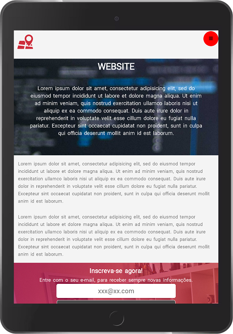

<h1>Lorem Site Responsive</h1>

Website desenvolviment with tecncology bases old design.

<h2>Why?</h2>

It's site of objective was create one, but without functions of now.  
Still an excelent element X for mobile/desktop pages (layout change).

By RYAN CASTRO FERREIRA, 
<b style="color: blue;">LinkdIn </b>- https://www.linkedin.com/in/ryan-castro-ferreira/ 
<b style="color: red;">Email </b>- ryancasf@gmail.com 

<h2>Screens</h2>

<h4>Please, Choose your width and heigth -> To Test.</h4>